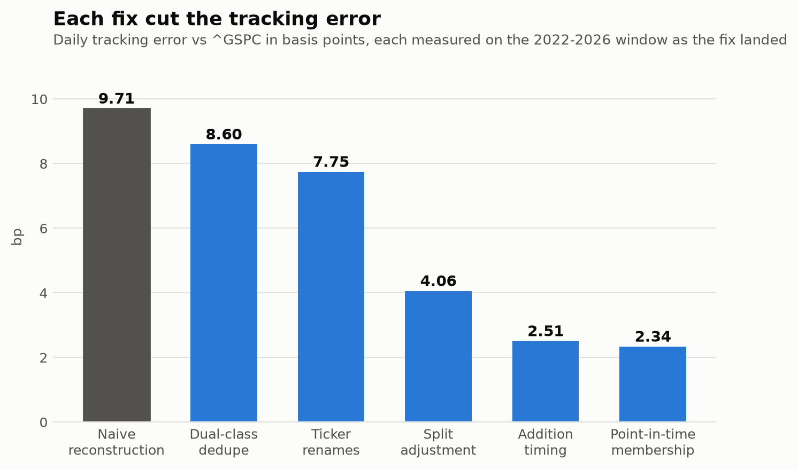
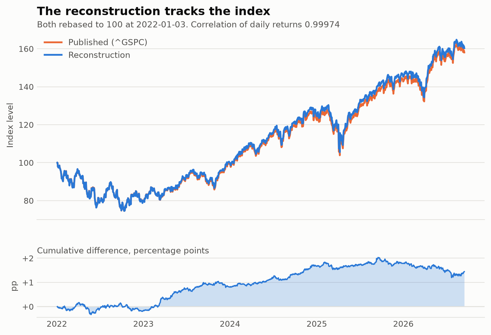
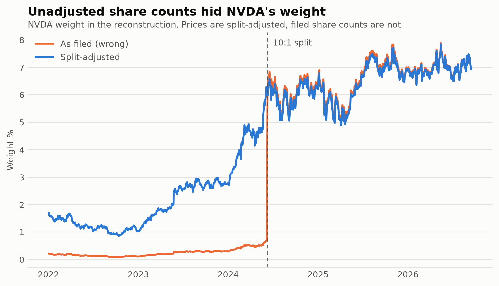
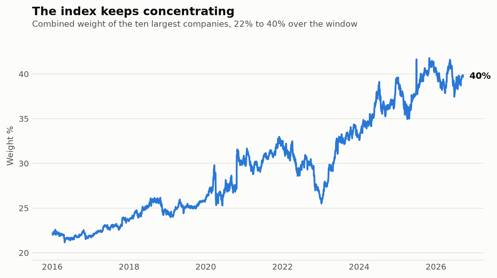
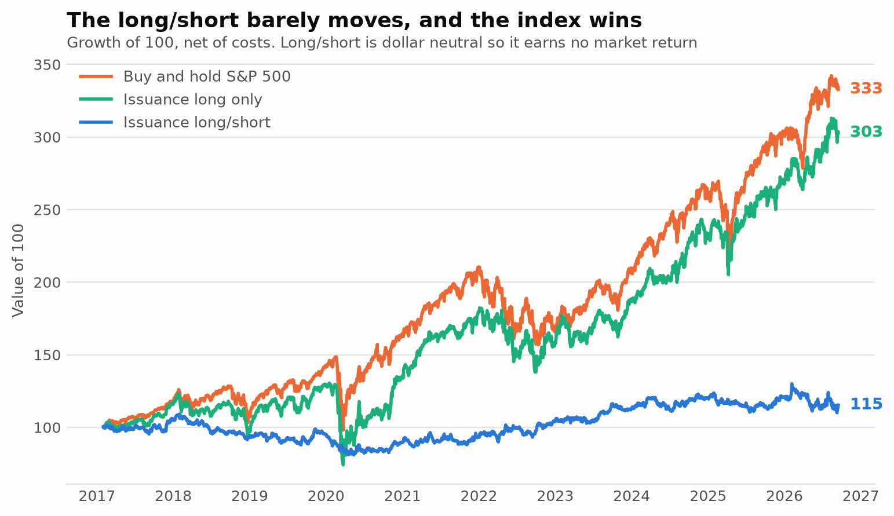
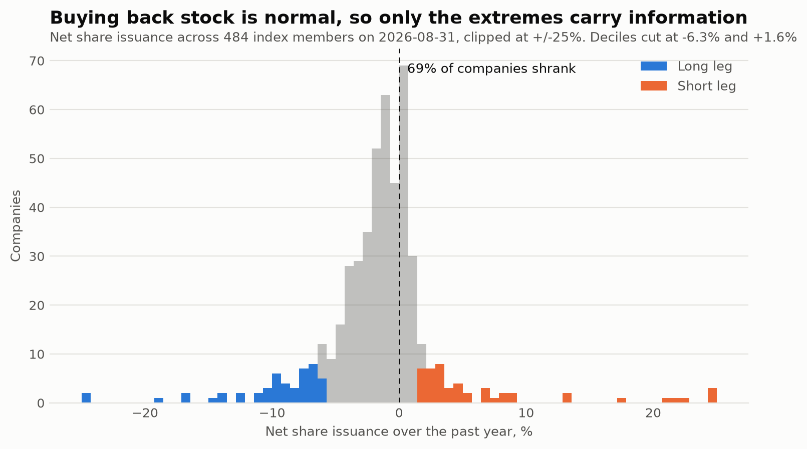
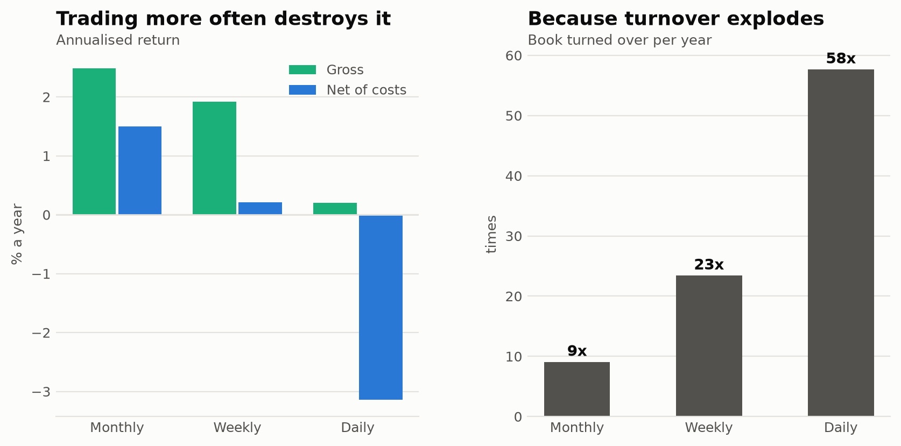
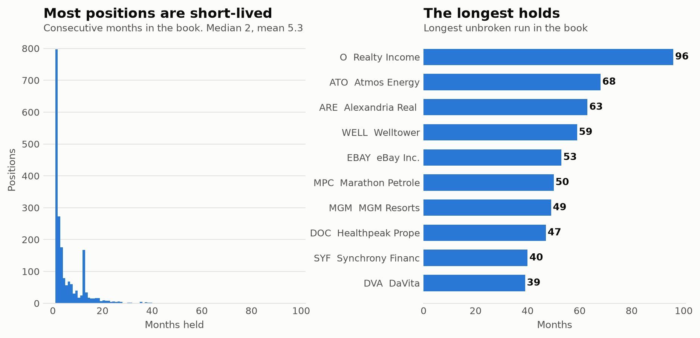

# Index Reconstructor

## Objective

This is a project aimed at consolidating historical stocks data and reconstructing indices that track
a combined basket of these stocks. Through processing massive financial datasets and validating results or explaining discrepancies, I aim to deepen my understanding of markets and financial data.

## Specification

This project will focus on the S&P 500 Index. I will focus on daily returns, attempting to match the constituent stocks to the Index's returns. To keep the first iteration simple, I will focus on the past 5 years of data from Yahoo Finance, and then increment the time horizon to introduce more complexities that could cause divergence in results.

## Initial Hypotheses

Reproducing the exact returns may be difficult to achieve, but any differences is what I want to explore, and be able to explain. The differences would likely come from the following sources: Inaccurate re-balancing of constituent stocks, missing or inaccurate data, survivorship bias, failure to incorporate stock splits / dividends.

## Actual Observations

I was able to achieve a 0.99957 correlation of daily returns between my reconstruction of the index and the actual data after several iterations. A few key contributing factors to initial divergence were stock splits, addition timings of stocks to the index, and renaming of tickers. While other defects still exist, such as the roughly 3% of index members that Yahoo no longer prices once they are acquired or delisted, I believe I have achieved the key objective of this study. Those interested in reading the findings in full can find them in [divergence.md](research/divergence.md). Some background research is also included in [s&p.md](research/s&p.md).

## Data Results

Each iteration removed a defect and tightened the tracking error. The basic reconstruction was at 9.71bp of daily tracking error against the published index. Each bar below was measured on the 2022-2026 window as the fix landed; on the full 2016-2026 window the finished reconstruction's tracking error sits at 3.30bp, the difference being that older data has thinner coverage.

Plotted against the published index over 2,690 trading days, the two series are hard to tell apart. The panel underneath shows the cumulative difference, which peaks near +3pp around the 2020 crash and settles under +2pp. The steady drift that used to sit here was the companies removed from the index, which point-in-time membership now handles.

The largest single error was stock splits. Yahoo returns prices that are split-adjusted all the way back, but share counts as they were filed at the time, so market cap was wrong by the split ratio for every day before a split. NVDA was carried at roughly a tenth of its true weight through the period it led the market.

With the reconstruction working, the weights themselves become worth looking at. The ten largest companies have gone from a third of the index to two fifths over the window.

## Backtest Results

With data that was more trustable, I tested a strategy that could build on the data work: **net share issuance**. Every index member is ranked by how much its share count changed over the past year, going long the biggest shrinkers (buybacks) and short the biggest growers (issuance). On raw filed share counts, a 10:1 split reads as +900% issuance, so without the split adjustment this would have been a split detector rather than a strategy.

The expectation came from the literature. Net share issuance is a documented anomaly and sits in the Fama-French five-factor model as CMA, the investment factor, so a small positive return with low market beta was the prior. Full write-up in [backtest.md](research/backtest.md).

Over 9.6 years of live trading, net of 5bp trading costs and 50bp annual borrow:

| | CAGR % | Sharpe | max DD % | beta | alpha % |
|---|---|---|---|---|---|
| Issuance long/short | 1.50 | 0.19 | -25.79 | -0.01 | 2.25 |
| Issuance long only | 12.24 | 0.65 | -43.15 | 1.00 | -0.41 |
| Buy and hold S&P 500 | 13.35 | 0.78 | -33.92 | 1.00 | 0.00 |

The strategy does not beat buying the index. A Sharpe of 0.19 over 116 rebalances cannot be distinguished from zero, so the honest reading is "no edge found" rather than "edge measured". It is genuinely market neutral, though, at a beta of -0.01.

The long-only leg tells the more interesting story. It returned 12.24% against the index's 13.35% with negative alpha, meaning the buyback names carried no information at all. The distribution explains why: on a typical day 69% of index members had shrunk their share count, so buying back stock is ordinary. Issuance is the abnormal behaviour, and whatever signal exists lives in the short leg.

Because the same code can run on either universe, survivorship bias could be measured directly. Running the identical strategy on the old biased universe inflated the Sharpe from 0.31 to 0.39 and nearly doubled the long book's apparent alpha, from 1.86% to 3.44%. Only the universe changed.

Rebalancing frequency mattered more than I expected. Moving from monthly to daily turned +1.50% a year into -3.14%, and gross return fell too, from 2.48% to 0.20%, so this is not only a cost story. Only about 77 of 408 names have a signal that changes on a given day, because share counts update on filings, so daily rebalancing re-cuts an unchanged ranking and pays spread for it.

Positions are held to the next rebalance with no stop loss or take profit, since the thesis is about a company's financing behaviour rather than its price. The book is 48 long and 48 short at 2.08% each, 79% of it carries over each month, and the median position lasts two months. The longest holds are REITs and utilities that issue equity persistently.

